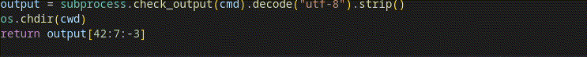

# Vscode Python Slice Descriptor Openai

A simple vscode extension that provides textual descriptions for the user of the currently hovered line if it contains a python slice.

[VSCode Marketplace Page](https://marketplace.visualstudio.com/items?itemName=guillaumerichard.vscode-python-slice-descriptor-openai)

## Requirements

- `vscode > 1.68.0`

## Example

## Extension Settings

Will automatically be prompted and stored in vscode SecretStorage:
- `apiKey` : Your openAI api key
- `model` : The model to use

You can run a command to set these using the `vscode command pallette (ctrl+shift+p)`:
- Python Slice Descriptor: Set OpenAI API Key
- Python Slice Descriptor: Set OpenAI Model
## Known Issues

- The openAI models I list are hard-coded, and the pricing is taken by hand off the openAI website.
- If you hover over any line with a slice python array, you will **PAY** with your openAI account, be weary of this.

#### Changelog

View it [here](./CHANGELOG.md)

**Enjoy!**
This is my first published extension, any comments will be appreciated, even very negative ones. ;)